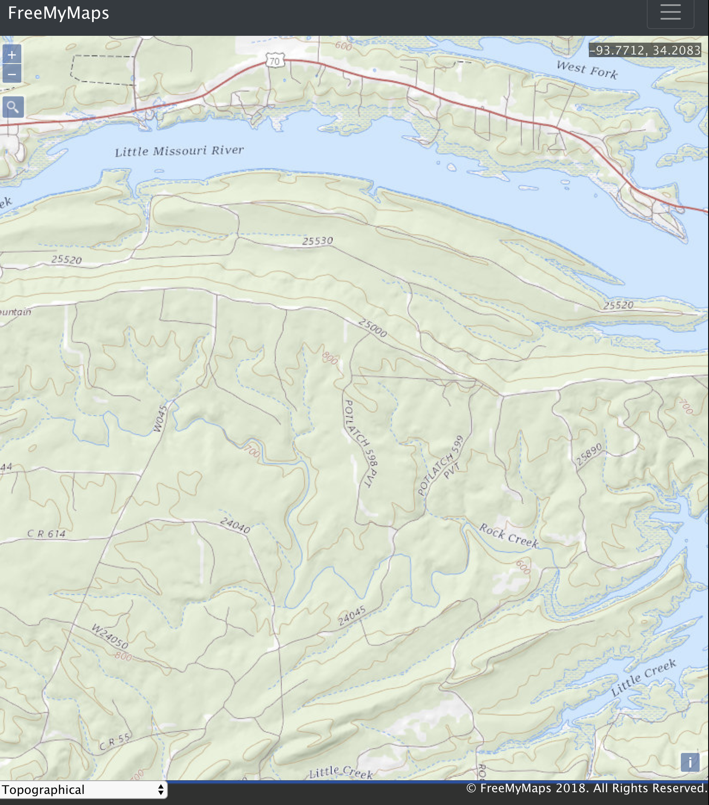

# FreeMyMaps

[](https://david-dm.org/dhull33/FreeMyMaps)
[](https://app.fossa.io/projects/git%2Bgithub.com%2Fdhull33%2FFreeMyMaps?ref=badge_shield)

A completely free mapping application that you can use or modify for your own app! What could be better than that? I'll let you decide!

https://freemymaps.com

## Current Features

1. 8 different map types

   - Topographical with Satellite (detailed view US only)
   - Topographical with contour lines (detailed view US only)
   - Normal Day
   - Normal Day Transit
   - Pedestrian Day
   - Terrain Day
   - Satellite Day
   - Hybrid Day

   

   P.S. check out this fantastic example that helped me quite a bit: https://openlayers.org/en/latest/examples/here-maps.html

2. OSM Geocoder
   - Uses Open Street Map Data and [ol-geocoder](https://github.com/jonataswalker/ol-geocoder)
3. Geolocation

   - It's surprisingly easy to get someone's location. The following code is all that is needed (public/javascripts/maps/mainMap.js line 360):

     ```javascript
     navigator.geolocation.getCurrentPosition((yourPosition) => {
       // yourPosition is an object from your brower's Geolocation API
     });
     ```

   - Here's a link from [Mozilla](https://developer.mozilla.org/en-US/docs/Web/API/Geolocation_API) that goes into more detail

4. Drawing

   - Freehand
   - Not freehand
   - Lines and Polygons ([in case you forgot what a polygon is](https://en.wikipedia.org/wiki/Polygon))

5. Accounts

- Can create an account with a unique username

## Features Soon to Be Added

1. Distance and Area estimation
   - Distance Units:
     - centimeters, meters, kilometers, inches, feet, miles
   - Area Units
     - centimeters^2, meters^2, kilometers^2, inches^2, feet^2, miles^2, acres
2. Editing
   - Erase anything that has been added to the map
   - Change line and fill colors
   - Drag anything added to the map by you
   - Modify lines and polygons
     - I like to think of this as 'stretching' or 'compressing' the feature
     - If you have a distance or area estimation attached to the modified line/polygon, that will also change
3. Drag and Drop GPX, GeoJSON, IGC, KML, or TopoJSON data
   - Will be displayed over the current map
4. Download and Saving
   - As a png image
   - or in GeoJSON format
   - Automatic saving to your account
5. Accounts
   - You will be able to create a free account with:
     - Facebook
     - Google
   - Create and save as many maps as your heart desires!
6. Docs and FAQ
   - Will detail the current features and how to use all of them

## Bugs

If you have encountered a bug or would like to request a feature, please use the [GitHub issue tracker](https://github.com/dhull33/FreeMyMaps/issues).
